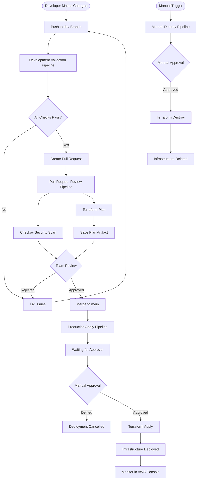

# Terraform CI/CD Pipeline - Complete Deployment Guide

This guide walks you through setting up a complete GitHub Actions CI/CD pipeline for Terraform infrastructure deployment from scratch.

## 📋 Table of Contents

1. [Prerequisites](#prerequisites)
2. [AWS Setup](#aws-setup)
3. [GitHub Repository Setup](#github-repository-setup)
4. [GitHub Secrets Configuration](#github-secrets-configuration)
5. [GitHub Environments Configuration](#github-environments-configuration)
6. [Testing the Pipelines](#testing-the-pipelines)
7. [Monitoring and Verification](#monitoring-and-verification)
8. [Troubleshooting](#troubleshooting)

---

## Prerequisites

Before starting, ensure you have:

- ✅ AWS Account with administrator access
- ✅ GitHub Account
- ✅ Git installed on your local machine
- ✅ AWS CLI installed and configured (optional, but recommended)
- ✅ Terraform installed locally for testing (optional)

---

## AWS Setup

### Step 1: Create IAM User for GitHub Actions

1. **Log in to AWS Console**: https://console.aws.amazon.com/

2. **Navigate to IAM**:
   - Go to Services → IAM
   - Click "Users" in the left sidebar
   - Click "Create user"

3. **Create User**:
   - User name: `github-actions-terraform`
   - Select "Access key - Programmatic access"
   - Click "Next"

4. **Attach Policies**:
   - Click "Attach policies directly"
   - Select the following policies:
     - ✅ `AmazonVPCFullAccess`
     - ✅ `AmazonEC2FullAccess`
     - ✅ `AmazonS3FullAccess`
     - ✅ `AmazonDynamoDBFullAccess`
   - Click "Next" → "Create user"

5. **Save Credentials**:
   - **IMPORTANT**: Download the CSV or copy:
     - Access Key ID
     - Secret Access Key
   - ⚠️ You won't be able to see the secret key again!

> [!WARNING]
> For production, use more restrictive IAM policies with least privilege access.

### Step 2: Create S3 Bucket for Terraform State

1. **Navigate to S3**: Services → S3

2. **Create Bucket**:
   ```
   Bucket name: terraform-state-<your-unique-id>
   Example: terraform-state-20260207-mycompany
   
   Region: us-east-1 (or your preferred region)
   
   Settings:
   ✅ Block all public access
   ✅ Enable versioning
   ✅ Enable default encryption (SSE-S3)
   ```

3. **Save the bucket name** - you'll need it for GitHub Secrets

### Step 3: Create DynamoDB Table for State Locking

1. **Navigate to DynamoDB**: Services → DynamoDB

2. **Create Table**:
   ```
   Table name: terraform-state-lock
   
   Partition key: LockID (Type: String)
   
   Table settings: Default settings
   
   Read/write capacity: On-demand
   ```

3. **Create Table** and wait for it to become active

### Step 4: Create SSH Key Pair (Optional but Recommended)

1. **Navigate to EC2**: Services → EC2

2. **Create Key Pair**:
   - Click "Key Pairs" in the left sidebar
   - Click "Create key pair"
   - Name: `terraform-pipeline-key`
   - Key pair type: RSA
   - Private key file format: `.pem` (for Linux/Mac) or `.ppk` (for Windows/PuTTY)
   - Click "Create key pair"

3. **Save the downloaded key file** securely - you'll need it to SSH into EC2 instances

---

## GitHub Repository Setup

### Step 1: Create GitHub Repository

1. **Go to GitHub**: https://github.com/

2. **Create New Repository**:
   - Click the "+" icon → "New repository"
   - Repository name: `terraform-pipelines`
   - Description: "Terraform CI/CD with GitHub Actions"
   - Visibility: Private (recommended) or Public
   - ❌ Do NOT initialize with README, .gitignore, or license
   - Click "Create repository"

### Step 2: Initialize Local Repository and Push Code

Open your terminal/command prompt and run:

```bash
# Navigate to your project directory
cd d:\terraform-pipelines

# Initialize git repository
git init

# Add all files
git add .

# Create initial commit
git commit -m "Initial commit: Terraform infrastructure and GitHub Actions pipelines"

# Add remote origin (replace with your repository URL)
git remote add origin https://github.com/YOUR_USERNAME/terraform-pipelines.git

# Create and push to main branch
git branch -M main
git push -u origin main

# Create dev branch
git checkout -b dev
git push -u origin dev
```

> [!TIP]
> Replace `YOUR_USERNAME` with your actual GitHub username.

---

## GitHub Secrets Configuration

### Step 1: Navigate to Repository Settings

1. Go to your repository on GitHub
2. Click **Settings** tab
3. Click **Secrets and variables** → **Actions** in the left sidebar

### Step 2: Add Repository Secrets

Click **"New repository secret"** and add each of the following:

#### Secret 1: AWS_ACCESS_KEY_ID
```
Name: AWS_ACCESS_KEY_ID
Value: [Your AWS Access Key ID from Step 1.5]
```

#### Secret 2: AWS_SECRET_ACCESS_KEY
```
Name: AWS_SECRET_ACCESS_KEY
Value: [Your AWS Secret Access Key from Step 1.5]
```

#### Secret 3: AWS_REGION
```
Name: AWS_REGION
Value: us-east-1
```
(Or your preferred AWS region)

#### Secret 4: TF_STATE_BUCKET
```
Name: TF_STATE_BUCKET
Value: terraform-state-<your-unique-id>
```
(The bucket name from Step 2.2)

#### Secret 5: TF_STATE_DYNAMODB_TABLE
```
Name: TF_STATE_DYNAMODB_TABLE
Value: terraform-state-lock
```

### Step 3: Verify Secrets

You should now have 5 secrets configured:
- ✅ AWS_ACCESS_KEY_ID
- ✅ AWS_SECRET_ACCESS_KEY
- ✅ AWS_REGION
- ✅ TF_STATE_BUCKET
- ✅ TF_STATE_DYNAMODB_TABLE

---

## GitHub Environments Configuration

### Step 1: Create Production Environment

1. In your repository, go to **Settings** → **Environments**

2. Click **"New environment"**
   - Name: `production`
   - Click **"Configure environment"**

3. **Configure Protection Rules**:
   
   ✅ **Required reviewers**:
   - Check "Required reviewers"
   - Add yourself (and team members)
   - This ensures manual approval before deployment
   
   ✅ **Deployment branches**:
   - Select "Selected branches"
   - Add rule: `main`
   - This prevents accidental deployments from other branches

4. Click **"Save protection rules"**

### Step 2: Verify Environment

You should now see:
- Environment name: `production`
- Protection rules: Required reviewers + Deployment branches

---

## Branch Protection Configuration

### Step 1: Configure Main Branch Protection

This ensures that code cannot be merged to `main` unless the CI/CD pipeline passes.

1.  Go to your repository **Settings**.
2.  Click **Branches** in the left sidebar.
3.  Click **"Add branch protection rule"**.
4.  **Branch name pattern**: `main`
5.  Check **"Require a pull request before merging"**.
6.  Check **"Require status checks to pass before merging"**.
7.  Search for and select your job name: `Security Scan & Plan Review`
    *   *Note: If you don't see this check, trigger a PR run first so GitHub registers the job name.*

### Step 2: Enforcing Strict Security Checks (Optional)

By default, the `pr-review.yml` pipeline uses `--soft-fail` for security scans. This means the pipeline will pass (green) even if Checkov finds security issues, allowing you to merge code with warnings.

**To BLOCK merges when security issues are found:**

1.  Open `.github/workflows/pr-review.yml`.
2.  Locate the "Run Checkov Security Scan" step.
3.  **Remove** the `--soft-fail` flag.
4.  **Remove** `continue-on-error: true`.

**Example Strict Configuration:**

```yaml
      - name: Run Checkov Security Scan
        id: checkov
        run: |
          checkov -d . \
            --framework terraform \
            --output cli \
            --output junitxml \
            --output-file-path console,checkov-report.xml
            # Removed --soft-fail to force failure on issues
```

With this change, any security finding will cause the pipeline to fail (red), and GitHub will block the merge until issues are fixed.

---

## Testing the Pipelines

### Phase 1: Test Development Validation Pipeline

This pipeline validates Terraform code on the `dev` branch.

1. **Update terraform.tfvars** (if needed):
   ```bash
   cd d:\terraform-pipelines
   
   # Edit terraform/terraform.tfvars and update:
   # - key_name = "terraform-pipeline-key" (your SSH key name)
   # - aws_region if different from us-east-1
   ```

2. **Commit and Push to dev branch**:
   ```bash
   git checkout dev
   git add terraform/terraform.tfvars
   git commit -m "Configure SSH key and region"
   git push origin dev
   ```

3. **Monitor the Pipeline**:
   - Go to your GitHub repository
   - Click **Actions** tab
   - You should see "Development Validation" workflow running
   
4. **Expected Results**:
   - ✅ Format Check: Should pass
   - ✅ Terraform Init: Should pass
   - ✅ Terraform Validate: Should pass
   - ✅ Terraform Plan: Should show resources to be created

5. **View Results**:
   - Click on the workflow run
   - Check the job summary for validation results
   - Review plan output to see what will be created

> [!NOTE]
> If the pipeline fails, check the logs for errors. Common issues:
> - Invalid AWS credentials
> - S3 bucket doesn't exist
> - DynamoDB table doesn't exist

### Phase 2: Test Pull Request Review Pipeline

This pipeline runs security scanning and generates plan artifacts.

1. **Create Pull Request**:
   ```bash
   # Make sure you're on dev branch with latest changes
   git checkout dev
   git pull origin dev
   ```

2. **Create PR on GitHub**:
   - Go to your repository on GitHub
   - Click **Pull requests** tab
   - Click **"New pull request"**
   - Base: `main` ← Compare: `dev`
   - Click **"Create pull request"**
   - Title: "Initial infrastructure deployment"
   - Click **"Create pull request"**

3. **Monitor the PR Pipeline**:
   - The "Pull Request Review" workflow should start automatically
   - Watch the checks section at the bottom of the PR

4. **Expected Results**:
   - ✅ Terraform Init: Should pass
   - ✅ Terraform Validate: Should pass
   - ✅ Checkov Security Scan: May show warnings (that's okay)
   - ✅ Terraform Plan: Should show resources to be created
   - ✅ Plan Artifact: Should be uploaded
   - ✅ PR Comment: Should appear with plan summary

5. **Review Plan Artifact**:
   - Scroll down to the workflow run
   - Click "Details" next to "Pull Request Review"
   - Click "Summary" in the left sidebar
   - Download "terraform-plan" artifact
   - Review `plan-output.txt` to see exactly what will be created

6. **Review Checkov Report**:
   - Download "checkov-security-report" artifact
   - Review any security warnings
   - For this demo, some warnings are acceptable

> [!IMPORTANT]
> **Do NOT merge the PR yet** - we'll do that in the next phase.

### Phase 3: Test Production Apply Pipeline

This pipeline applies infrastructure changes after manual approval.

1. **Merge the Pull Request**:
   - If you're satisfied with the plan output from Phase 2
   - Click **"Merge pull request"** on the PR
   - Click **"Confirm merge"**
   - The PR will be merged to `main`

2. **Monitor Approval Request**:
   - Go to **Actions** tab
   - Click on the "Production Apply" workflow that just started
   - You'll see it's waiting for approval
   - Status: **"Waiting"** (yellow circle)

3. **Review and Approve Deployment**:
   - Click **"Review deployments"** button
   - Check the checkbox next to "production"
   - Click **"Approve and deploy"**

4. **Monitor Deployment**:
   - The workflow will now continue
   - Watch the "Terraform Apply" step
   - This will take 2-5 minutes to create all resources

5. **Expected Results**:
   - ✅ Terraform Init: Success
   - ✅ Terraform Plan: Shows resources to create
   - ✅ Terraform Apply: Success
   - ✅ Infrastructure outputs displayed

6. **Get Infrastructure Details**:
   - Click on the workflow run
   - Scroll to "Deployment Summary"
   - Note the:
     - VPC ID
     - EC2 Instance ID
     - **EC2 Public IP** (you'll use this to test)

### Phase 4: Verify Infrastructure in AWS Console

1. **Verify VPC**:
   - Go to AWS Console → VPC
   - You should see: `terraform-pipeline-vpc`
   - Click on it and verify:
     - ✅ CIDR: 10.0.0.0/16
     - ✅ DNS hostnames: Enabled

2. **Verify Subnet**:
   - In VPC Dashboard → Subnets
   - You should see: `terraform-pipeline-public-subnet`
   - Verify:
     - ✅ CIDR: 10.0.1.0/24
     - ✅ Auto-assign public IP: Yes

3. **Verify Internet Gateway**:
   - In VPC Dashboard → Internet Gateways
   - You should see: `terraform-pipeline-igw`
   - Verify it's attached to your VPC

4. **Verify Route Table**:
   - In VPC Dashboard → Route Tables
   - Find: `terraform-pipeline-public-rt`
   - Check Routes tab:
     - ✅ 10.0.0.0/16 → local
     - ✅ 0.0.0.0/0 → igw-xxxxx

5. **Verify EC2 Instance**:
   - Go to EC2 Dashboard → Instances
   - You should see: `terraform-pipeline-ec2-instance`
   - Status: Running (green)
   - Note the **Public IPv4 address**

6. **Verify Security Group**:
   - In EC2 Dashboard → Security Groups
   - Find: `terraform-pipeline-ec2-sg`
   - Inbound rules should have:
     - ✅ SSH (22) from 0.0.0.0/0
     - ✅ HTTP (80) from 0.0.0.0/0
     - ✅ HTTPS (443) from 0.0.0.0/0

### Phase 5: Test the Web Server

1. **Get the Public IP**:
   - From the GitHub Actions output OR
   - From AWS EC2 Console

2. **Access the Web Server**:
   - Open your browser
   - Navigate to: `http://[EC2_PUBLIC_IP]`
   - Example: `http://54.123.45.67`

3. **Expected Result**:
   - You should see a purple gradient page with:
     - "🚀 Terraform Pipeline Success!"
     - Environment details
     - Deployment confirmation message

> [!TIP]
> If the page doesn't load immediately, wait 1-2 minutes for the user_data script to complete Apache installation.

### Phase 6: Test SSH Access (Optional)

If you configured an SSH key pair:

```bash
# Using the key you downloaded earlier
ssh -i terraform-pipeline-key.pem ec2-user@[EC2_PUBLIC_IP]

# If you get a permissions error on Windows, first:
# icacls terraform-pipeline-key.pem /inheritance:r
# icacls terraform-pipeline-key.pem /grant:r "%username%:R"

# Once connected, you can:
# - Check the web server: sudo systemctl status httpd
# - View logs: sudo tail -f /var/log/httpd/access_log
# - Exit: exit
```

### Phase 7: Test Manual Destroy Pipeline

This pipeline safely destroys all infrastructure.

1. **Navigate to Actions**:
   - Go to **Actions** tab
   - Click "Manual Destroy Infrastructure" in the left sidebar

2. **Run Workflow**:
   - Click **"Run workflow"** dropdown
   - Select branch: `main`
   - In the confirmation field, type: `DESTROY`
   - Click **"Run workflow"**

3. **Approve Destruction**:
   - Click on the running workflow
   - Wait for the approval request
   - Click **"Review deployments"**
   - Check "production"
   - Click **"Approve and deploy"**

4. **Monitor Destruction**:
   - Watch the workflow execute
   - The destroy process takes 2-5 minutes
   - All resources will be deleted

5. **Verify in AWS Console**:
   - Go to EC2 → Instances
   - The instance should be terminated
   - Go to VPC Dashboard
   - The VPC and related resources should be deleted

> [!CAUTION]
> This will permanently delete all infrastructure. Make sure you want to proceed before approving.

---

## Monitoring and Verification

### GitHub Actions Monitoring

**View All Workflows**:
- Go to **Actions** tab
- See history of all pipeline runs
- Filter by workflow, branch, or status

**Workflow Run Details**:
- Click any workflow run
- View logs for each step
- Download artifacts
- See job summaries

**Artifacts**:
- Terraform plans (30-day retention)
- Checkov security reports (30-day retention)

### AWS Cost Monitoring

**View Current Costs**:
1. AWS Console → Billing Dashboard
2. Check "Month-to-Date Spend"
3. View by service

**Expected Costs** (for this demo):
- EC2 t2.micro: ~$0.01/hour (free tier eligible)
- VPC: Free
- S3: Minimal (< $0.01/month)
- DynamoDB: Free tier
- **Total**: < $10/month or FREE with AWS Free Tier

**Set Up Billing Alerts**:
1. AWS Console → CloudWatch → Billing
2. Create alarm for monthly spend > $5
3. Get email notifications

---

## Troubleshooting

### Common Issues and Solutions

#### Issue 1: "Error: Error creating VPC: UnauthorizedOperation"

**Cause**: IAM user lacks permissions

**Solution**:
1. Go to IAM → Users → github-actions-terraform
2. Add `AmazonVPCFullAccess` policy
3. Wait 1-2 minutes for permissions to propagate
4. Re-run the workflow

#### Issue 2: "Error: NoSuchBucket: The specified bucket does not exist"

**Cause**: S3 bucket name is incorrect or not created

**Solution**:
1. Check `TF_STATE_BUCKET` secret matches actual bucket name
2. Verify bucket exists in S3 console
3. Ensure bucket is in the same region as `AWS_REGION` secret

#### Issue 3: "Error: ResourceNotFoundException: Requested resource not found"

**Cause**: DynamoDB table doesn't exist

**Solution**:
1. Go to DynamoDB console
2. Create table named `terraform-state-lock`
3. Partition key: `LockID` (String)
4. Update `TF_STATE_DYNAMODB_TABLE` secret if needed

#### Issue 4: Terraform Plan Shows "Error: InvalidKeyPair.NotFound"

**Cause**: SSH key pair name doesn't exist in AWS

**Solution**:
1. Edit `terraform/terraform.tfvars`
2. Set `key_name = ""` to disable SSH (or)
3. Create the key pair in EC2 console and update the variable

#### Issue 5: "Error acquiring the state lock"

**Cause**: Previous terraform run didn't release the lock

**Solution**:
1. Go to DynamoDB → terraform-state-lock table
2. Delete the lock item (if it exists)
3. Re-run the workflow

#### Issue 6: Checkov Scan Fails with Many Errors

**Cause**: Terraform code has security issues

**Solution**:
- Review the Checkov report artifact
- Most warnings are acceptable for demo/dev environments
- For production, address critical security findings
- The pipeline uses `--soft-fail` so it won't block deployment

#### Issue 7: Web Server Not Accessible

**Cause**: Instance still initializing or security group issue

**Solution**:
1. Wait 2-3 minutes after instance creation
2. Check security group allows HTTP (port 80)
3. Verify instance has public IP
4. Check instance status in EC2 console (should be "running")
5. Try accessing via HTTPS: `http://` (not https)

#### Issue 8: "Workflow does not have 'actions: read' permissions"

**Cause**: Repository permissions issue

**Solution**:
1. Go to Settings → Actions → General
2. Workflow permissions → Select "Read and write permissions"
3. Save changes
4. Re-run the workflow

---

## Pipeline Workflow Diagram



---

## Next Steps

After successfully deploying your infrastructure:

1. **Customize Terraform Code**:
   - Add more AWS resources (RDS, S3, ELB, etc.)
   - Create reusable modules
   - Implement multiple environments

2. **Enhance Pipelines**:
   - Add automatic drift detection (e.g., scheduled `terraform plan`)
   - Add Slack/Teams notifications for deployment status
   - Use OIDC for secure AWS authentication instead of static credentials

   **Adding Security Scanning (Optional)**:
   You can add Checkov to your production pipeline as an advisory step. Use `--soft-fail` to ensure security warnings don't block critical deployments. Add this before the `Terraform Plan` step:

   ```yaml
      - name: Setup Python for Checkov
        uses: actions/setup-python@v5
        with:
          python-version: '3.11'

      - name: Install Checkov
        run: pip install checkov

      - name: Run Checkov Security Scan
        id: checkov
        # NOTE: Security scan is configured to NOT fail the build (--soft-fail).
        # We explicitly allow the pipeline to continue even if security issues are found.
        run: |
          checkov -d . \
            --framework terraform \
            --output cli \
            --output junitxml \
            --output-file-path console,checkov-report.xml \
            --soft-fail
        continue-on-error: true

      - name: Upload Checkov Report
        if: always()
        uses: actions/upload-artifact@v4
        with:
          name: checkov-security-report
          path: terraform/checkov-report.xml
          retention-days: 30
   ```

3. **Improve Security**:
   - Restrict SSH access to specific IPs
   - Implement AWS Systems Manager for instance access
   - Add WAF for web application protection
   - Enable AWS Config for compliance monitoring

4. **Scale Your Infrastructure**:
   - Add auto-scaling groups
   - Implement load balancers
   - Set up multi-AZ deployments
   - Add CloudWatch monitoring and alarms

---

## Additional Resources

- [Terraform Documentation](https://www.terraform.io/docs)
- [GitHub Actions Documentation](https://docs.github.com/en/actions)
- [AWS Well-Architected Framework](https://aws.amazon.com/architecture/well-architected/)
- [Checkov Documentation](https://www.checkov.io/documentation)

---

## Support

If you encounter issues not covered in the troubleshooting section:

1. Check GitHub Actions logs for detailed error messages
2. Review AWS CloudTrail for API call failures
3. Verify all prerequisites are met
4. Check GitHub Actions status page for service issues

---

**🎉 Congratulations!** You've successfully set up a complete Terraform CI/CD pipeline with GitHub Actions!
